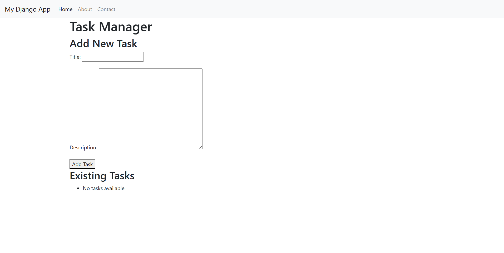
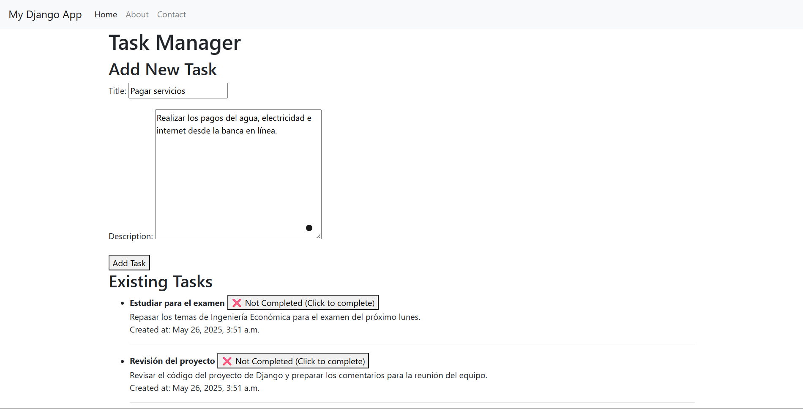
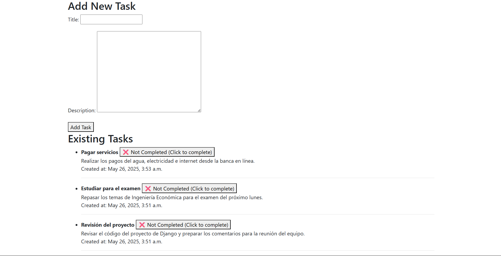
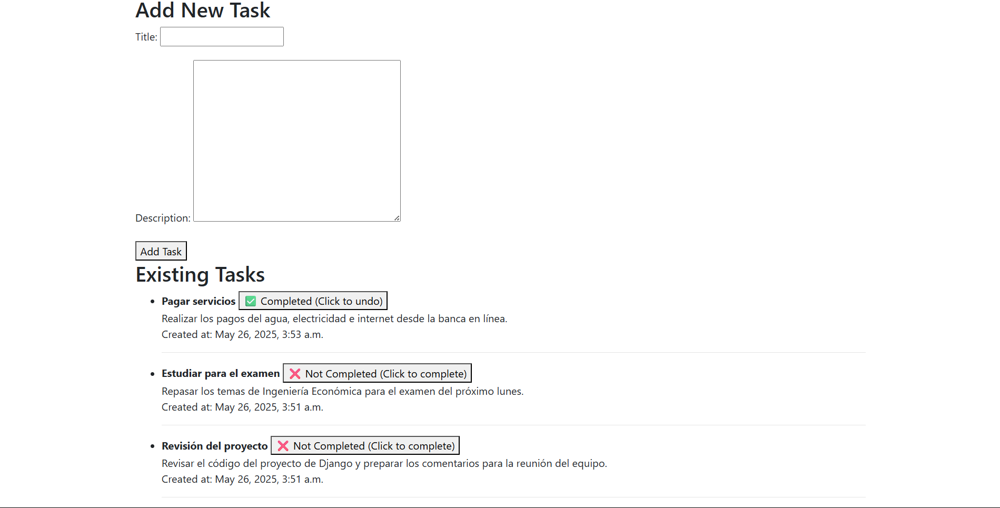

# Universidad de Costa Rica  
**Escuela de Ingeniería Eléctrica**  
**IE-0417 – Diseño de Software para Ingeniería**  
**Laboratorio 5: Despliegue de una aplicación Django con Docker**  

---

## 🎯 Objetivo

Desplegar una aplicación Django funcional utilizando Docker y Docker Compose, aplicando buenas prácticas en la definición de imágenes, redes y persistencia de datos.

---

## 🔧 Descripción General del Sistema

La infraestructura del sistema se compone de dos contenedores: uno para la aplicación Django y otro para la base de datos PostgreSQL. Ambos se comunican a través de una red Docker personalizada, y la base de datos persiste la información mediante un volumen Docker.

---

## 📊 Diagrama de Arquitectura

```mermaid
graph TD
    subgraph Docker_Host["Host Docker (Linux/Windows)"]
        subgraph Red_App["Red: app_network (bridge)"]
            Django[🛠️ Contenedor Django<br>python:3.11.10<br>Puerto: 8000] -->|DNS: 'db'| Postgres[🐘 Contenedor PostgreSQL<br>postgres:17<br>Puerto: 5432]
        end
        Volumen[(💾 postgres_data<br>/var/lib/postgresql/data)] --> Postgres
    end
    Usuario[👤 Usuario] -->|localhost:8000| Django
```

---

## 🧱 Componentes del Sistema

### Servicios Docker (`docker-compose.yml`)

```yaml
services:
  django-web:
    build: .
    ports:
      - "8000:8000"
    networks:
      - app_network
    depends_on:
      - db
    env_file:
      - .env

  db:
    image: postgres:17
    volumes:
      - postgres_data:/var/lib/postgresql/data
    networks:
      - app_network
    environment:
      POSTGRES_DB: ${DATABASE_NAME}
      POSTGRES_USER: ${DATABASE_USERNAME}
      POSTGRES_PASSWORD: ${DATABASE_PASSWORD}

networks:
  app_network:
    driver: bridge

volumes:
  postgres_data:
```

### Configuración Django (`settings.py`)

```python
DATABASES = {
     'default': {
         'ENGINE': 'django.db.backends.{}'.format(
             os.getenv('DATABASE_ENGINE', 'sqlite3')
         ),
         'NAME': os.getenv('DATABASE_NAME', 'databaseDEFAULT'),
         'USER': os.getenv('DATABASE_USERNAME', 'myprojectuser'),
         'PASSWORD': os.getenv('DATABASE_PASSWORD', 'password'),
         'HOST': os.getenv('DATABASE_HOST', '127.0.0.1'),
         'PORT': os.getenv('DATABASE_PORT', 5432),
     }
 }
```

### Variables de Entorno (`.env`)

```ini
SECRET_KEY='django-insecure-pg#x^e9dgwhbpvz#=nuug(&@apxedkhurj%&ycn3al+@dmzrzj'
DEBUG=True
DJANGO_LOGLEVEL=info
DJANGO_ALLOWED_HOSTS=localhost
DATABASE_ENGINE=postgresql_psycopg2
DATABASE_NAME=dockerdjango
DATABASE_USERNAME=dbuser
DATABASE_PASSWORD=dbpassword
DATABASE_HOST=db
DATABASE_PORT=5432
```

---

### 🌐 Red Docker

- **Nombre:** app_network
- **Tipo:** bridge
- **Uso:** Comunicación segura entre Django y PostgreSQL. Permite resolver el contenedor db mediante DNS interno.

### 💾 Volúmenes

- **Nombre:** postgres_data
- **Ruta interna (en contenedor):** `/var/lib/postgresql/data`
- **Ruta en el host (gestionada por Docker):**  
  `~/.docker/volumes/docker-django-db_postgres_data/_data`

**Función:** Almacenar los datos persistentes de PostgreSQL incluso si se elimina el contenedor.

### 🚪 Mapeo de Puertos

| Servicio   | Puerto Contenedor | Puerto Host   | Propósito                      |
| ---------- | ----------------- | ------------- | ------------------------------ |
| django-web | 8000              | 8000          | Acceso a la aplicación web     |
| db         | 5432              | *no expuesto* | Uso interno entre contenedores |

---

### 🔁 Flujo de Comunicación

- El usuario accede desde el navegador en `localhost:8000`.
- El contenedor Django recibe la petición y, si es necesario, consulta la base de datos.
- El contenedor PostgreSQL responde a Django.
- Los datos de PostgreSQL se almacenan de forma persistente en el volumen `postgres_data`.

---

### 🧪 Verificación de Salud

```bash
# Verificar contenedores y estado (healthy)
docker compose ps

# Inspeccionar red y conexión interna
docker network inspect app_app_network

# Verificar volumen persistente
docker volume inspect app_postgres_data
```

---

### 📝 Notas Finales

- La red personalizada permite comunicación segura entre contenedores sin exponer innecesariamente la base de datos.
- El volumen garantiza la persistencia de datos de PostgreSQL.
- Los healthcheck permiten automatizar la verificación de conectividad entre servicios.
- Solo el servicio Django está expuesto al host, siguiendo el principio de menor superficie de ataque.

---

## 📁 Explicación de Archivos Clave

### `Dockerfile`

Define cómo se construye la imagen personalizada para el contenedor Django.

**Funciones principales:**
- Usa `python:3.11` como imagen base.
- Copia el código fuente al contenedor.
- Instala las dependencias desde `requirements.txt`.
- Expone el puerto `8000`.
- Define el comando de inicio (`CMD`) para ejecutar Django.

---

### `docker-compose.yml`

Orquesta los servicios del sistema: Django y PostgreSQL. Modificado/adaptado de guía oficial para [adaptar un projecto Django con Docker](https://www.docker.com/blog/how-to-dockerize-django-app/).

**Funciones principales:**
- Define los contenedores y sus relaciones.
- Asigna puertos entre contenedor y host.
- Establece una red personalizada `app_network`.
- Crea un volumen `postgres_data` para persistencia de datos.

---

### `.env`

Archivo que contiene variables de entorno sensibles. Modificado/adaptado de guía oficial para [adaptar un projecto Django con Docker](https://www.docker.com/blog/how-to-dockerize-django-app/).


**Variables comunes:**

```dotenv
DATABASE_NAME=appdb
DATABASE_USERNAME=dbuser
DATABASE_PASSWORD=dbpass
SECRET_KEY=tu_clave_secreta
```

---

### `requirements.txt`

Lista de dependencias de Python necesarias para la app Django.

**Ejemplo:**

```ini
Django==4.2.1
psycopg2-binary==2.9.6
```

---

### `docker-entrypoint.sh`

Script opcional ejecutado al iniciar el contenedor Django.

**Tareas típicas:**
- Esperar que PostgreSQL esté disponible.
- Ejecutar migraciones automáticamente.
- Crear superusuario.
- Ejecutar el CMD establecido en el Dockerfile.

---

### `manage.py`

**Funciones principales:**
- Establece la variable de entorno `DJANGO_SETTINGS_MODULE` con la ruta `app.settings`.
- Importa y ejecuta `execute_from_command_line()` desde Django.
- Permite ejecutar comandos como migraciones, ejecución del servidor, creación de usuarios, etc.


---

### `app/` (directorio del proyecto Django)

Contiene la configuración principal del proyecto.

- `settings.py`: Configura base de datos, apps instaladas, seguridad, etc.
- `urls.py`: Define las rutas de la aplicación.
- `wsgi.py` / `asgi.py`: Interfaces con servidores web.

---

### `taskManager/` (aplicación Django interna)

Contiene la lógica específica de la app.

- `models.py`: Define las tablas y campos de la base de datos.
- `views.py`: Lógica de respuesta a solicitudes del usuario.
- `templates/`: Archivos HTML de la interfaz.
- `forms.py`: Formularios web.
- `admin.py`: Registro de modelos para el panel de administración.
- `migrations/`: Scripts generados para aplicar cambios en el modelo.

## 🧪 Instrucciones para Ejecutar el Entorno Desde Cero

### ✅ Requisitos Previos
Antes de iniciar, asegurate de tener instalado en tu sistema:

- [Docker](https://www.docker.com/)
- [Docker Compose](https://docs.docker.com/compose/)

---

### 📁 Estructura Esperada del Proyecto
```markdown
app/
├── Dockerfile
├── docker-compose.yml
├── .env
├── .docker-entrypoint.sh
├── requirements.txt
├── manage.py
├── app/
│   ├── settings.py
│   └── ...
├── taskManager/
│   ├── models.py
│   └── views.py
└── postgres/
    └── backups/
```
---

## 🛠️ Pasos para Desplegar la Aplicación
### 🔄 Flujo de Despliegue Completo
```mermaid
graph TD
    A[Clonar Repositorio] --> C[Configurar .env]
    C --> D[Inicializar DB]
    D --> E[Acceder a la Aplicación]
```
1. **Clonar el repositorio** (si es necesario):

   ```bash
   git clone https://github.com/usuario/proyecto-django.git
   cd proyecto-django
   ```

2. **Construir y levantar los contenedores** desde la raíz del proyecto:

   ```bash
   docker compose up -d --build
   # Verificar estado (ambos servicios deben mostrar 'healthy')
    watch -n 2 docker compose ps
   ```

   Esto realizará lo siguiente:
   - Construirá la imagen de Django usando el Dockerfile.
   - Iniciará los contenedores `django-web` y `db`.
   - Aplicará healthchecks y dependencias definidas en `docker-compose.yml`.

---
3. **🌍 Verificar Aplicación**  
- Navegar a: http://localhost:8000

- Admin de Django: http://localhost:8000/admin

4. **🧹 Detener y Limpiar el Entorno** 
Para detener la aplicación:

```bash
docker compose down
```

Para eliminar los volúmenes persistentes (como la base de datos):

```bash
docker compose down -v
```
## 📸 Aplicación Web en Funcionamiento

A continuación se muestran capturas de pantalla de la interfaz de la aplicación Django, funcionando correctamente mediante contenedores Docker.

### 📱 Interfaz de la Aplicación en Docker

La interfaz principal muestra:

- Un formulario para **agregar una nueva tarea**, con campos para el nombre (título) y la descripción.
- Una lista de **tareas existentes**.
- Un botón para **marcar como completada** (✅) o **pendiente** (❌) cada tarea.

#### 🔽 Estructura HTML renderizada:



---

### ✅ Funcionalidades Visibles

- 🎨 **Bootstrap 4** para un estilo visual moderno y responsive.
- 🧭 Navbar con enlaces (Home, About, Contact).
- 🛡️ Formularios protegidos con `csrf_token`.
- 🧱 Renderizado dinámico mediante bloques de plantilla `` de Django.
- 🔁 Botones interactivos para cambiar el estado de cada tarea sin necesidad de recargar la página completa.

---

### 🆕 Agregar una Nueva Tarea

Formulario donde el usuario puede ingresar el nombre y la descripción de una tarea nueva:



---

### 📋 Visualización de Varias Tareas

Vista donde ya se han agregado múltiples tareas a la lista:



---

### ✅ Marcar una Tarea como Completada

Al hacer clic sobre el botón correspondiente, se actualiza el estado de la tarea y se muestra como completada:



---

### 📝 Código Base de Plantilla HTML

La interfaz fue desarrollada utilizando el sistema de plantillas de Django. El archivo `base.html` (tomado y corregido de una [guía de Django](https://www.youtube.com/watch?v=nGIg40xs9e4):) define la estructura principal del sitio, incluyendo una barra de navegación y un contenedor donde se inserta dinámicamente el contenido de cada página utilizando bloques ``. Esto permite una presentación coherente y reutilizable en todas las vistas de la aplicación.

---

### ✅ Conclusión

Estas capturas y funcionalidades demuestran que la aplicación está correctamente desplegada y funcionando dentro de un entorno Docker. Se logra una experiencia fluida para el usuario, permitiéndole gestionar tareas de manera intuitiva a través de una interfaz limpia y moderna. Además, el uso de contenedores facilita la instalación, el mantenimiento y la portabilidad del proyecto, validando el enfoque adoptado para un desarrollo web robusto y escalable.
